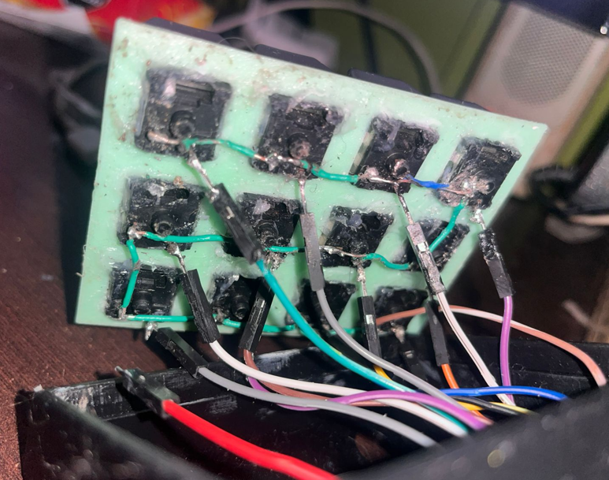
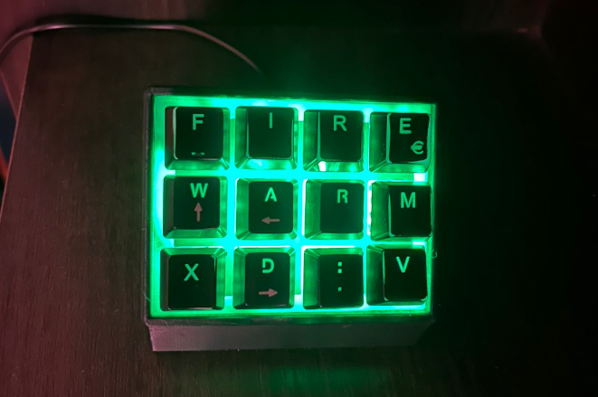

# Arduino Stream Deck (HID – F13 to F25)

---

## Description

This project started by salvaging working black switches from a broken Sentey keyboard that a friend gave me.  
After testing each switch with a multimeter, I decided to reuse them to build a custom Arduino-based Stream Deck.

Although there are many similar projects available online, most of them rely on third-party software.  
I found this approach suboptimal, especially on Windows, where installing unverified applications can be inconvenient or problematic for many users.

For this reason, I decided to take advantage of the Arduino HID (Human Interface Device) capability and make the device work as a native keyboard extension.  
By using the rarely used F13 to F25 keys, which are fully recognized by Windows, this Stream Deck can be easily configured in third-party applications such as Discord, OBS, or any software that supports custom key bindings, without installing additional software.

---

## 3D Printed Case

I only printed the case from the following model (this is not my original design):

https://www.printables.com/model/269757-stream-deck-macro-keyboard

All STL files belong to their respective creator.  
Full credits go to the original designer.

The switches and keycaps were reused from the original keyboard.

Since this device was made as a gift for a streamer, the front was customized with their artistic name and a small “XD :V” detail.

---

## Hardware Assembly

1. I first installed the switches into the printed plate to improve efficiency and comfort while soldering.
2. All switches were connected together using a common GND bridge.
3. Each switch output was wired individually to a digital pin on the Arduino.
4. A NeoPixel LED board was connected to pin A1 and mounted on the top.
5. The switches were fixed from the back using hot glue.
6. The Arduino was carefully positioned to align with the case USB port and fixed with hot glue to ensure a proper connection.

The build process is relatively simple, which is why only a few photos were taken.

---

## Software and Functionality

The code is intentionally simple and easy to understand.

### Keyboard Features

- Each button sends F13 to F25 key presses
- Compatible with:
  - Discord (mute, deafen, push-to-talk)
  - OBS (scene transitions, actions)
  - Any application that supports custom keyboard shortcuts
- No external software required

---

## RGB Lighting Modes

The first two buttons are used to control the lighting modes.

Available modes:

1. Rainbow mode  
   The last button cycles through three different speed settings.
2. RGB breathing mode with changing colors
3. Green breathing mode (favorite color of the gift recipient)
4. Solid green mode
5. Reactive mode, where the LEDs light up and change color when a button is pressed

---

## Build Time

The project was completed in approximately one week.  
The longest part of the process is printing the case, but it is still a minor task overall.

---

## Known Limitations and Improvements

After gifting the device, several possible improvements were identified:

1. The internal wiring partially blocks the RGB lighting because the LED board was installed after the Arduino wiring.
2. The front panel was printed in green; white or transparent filament could improve light diffusion.
3. There is no lighting-off mode, which may be inconvenient since the Arduino remains powered while connected to a PC.
4. The buttons used to control lighting modes still send F13, F14, and F25 key presses, which could cause conflicts depending on the configured shortcuts.

These are the main issues observed so far, and there is room for further improvement.

---

[Watch demo video on YouTube](https://www.youtube.com/watch?v=TU_LINK](https://www.youtube.com/shorts/s9-_362nHXg))

## Credits and Inspiration

This project was inspired by the following guide:

https://www.instructables.com/HyperDeck-an-Arduino-Streamdeck/

All credits go to the original authors.
